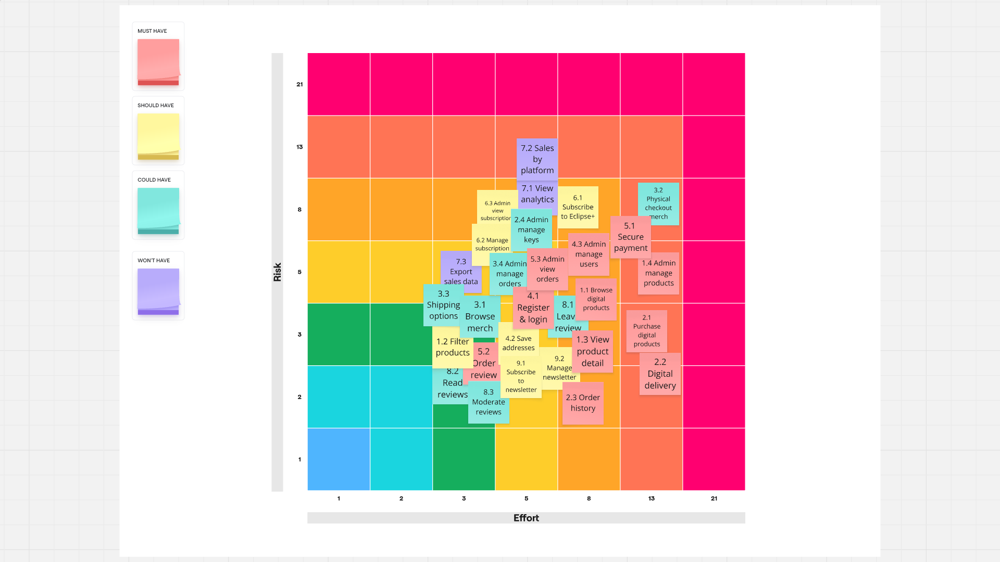

# Eclipse Protocol E-Commerce 

A fictional e-commerce platform for a speculative video game company, Dark Sky Games, selling digital products and physical merchandise on a dedicated store for their game - Eclipse Protocol. 

## Wireframes:

### Landing Page:

### Base Game Product Page:

### Edition Details:

### DLC Product Page:

### Eclipse Plus Subscription Page:

### Subscription Payment Page:

### Game Currency Details Page:

### Search Results Page:

### Merchandise Product Page:

### Merchandise Detail Page:

### Sign In Page:

### Create Account Page:

### User Account: 

### Wishlist Page:

### Cart Page:

### Payment/Billing MVP Page:

### Billing and Shipping Details Page:

### Digital Sale Only Billing:

### Order Confirmation of Purchase Page:

### Contact/Support Page:

### Confirmation Contact/Support Submission Page:

### Information Pages: 

### Error 404 Page:

## ERD Diagram:

## Themes and Epics:

(table with user story and fibonacci points)

## Effort Risk Fibonacci Matrix:

