Contents

1. [HTML Validation](#1-html-validation)
2. [CSS Validation](#2-css-validation)
3. [JavaScript Validation](#3-javascript-validation)
4. [Python Code Quality](#4-python-code-quality)
5. [Lighthouse Performance Testing](#5-lighthouse-performance-testing)
6. [Responsiveness Design Testing](#6-responsiveness-design-testing)
7. [User Story Testing](#7-user-story-testing)
8. Automated Testing
9. Manual Testing
- Navigation Testing
- Form Testing
- Defensive Programming Testing
- Authentication Security Testing
- Input Validation
10. AWS S3 Storage Testing
11. Fixed Issues
12. Bug Reporting

## 1. HTML Validation

## HTML Validation

All pages tested using [W3C Markup Validator](https://validator.w3.org/).

| Page | URL | Status | Screenshot | Validation Link | Notes |
|------|-----|--------|------------|----------------|-------|
| [Home Store Front Page](https://eclipse-protocol-15d26c9e2a55.herokuapp.com/) | `/` | ✅ | 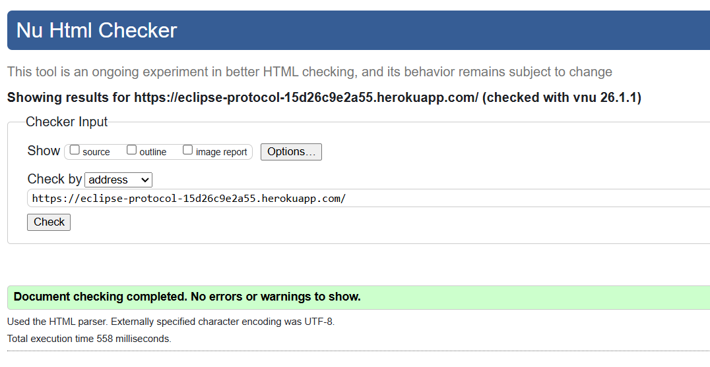 | [Home Result](https://validator.w3.org/nu/?doc=https%3A%2F%2Feclipse-protocol-15d26c9e2a55.herokuapp.com%2F) |  |
| [Login Page](https://eclipse-protocol-15d26c9e2a55.herokuapp.com/accounts/login/) | `/accounts/login/` | ✅ | 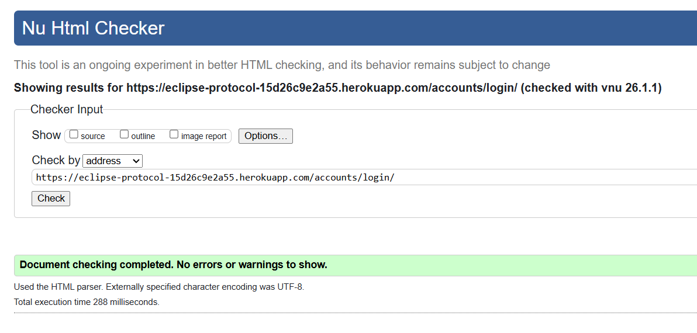 | [Login Result](https://validator.w3.org/nu/?doc=https%3A%2F%2Feclipse-protocol-15d26c9e2a55.herokuapp.com%2Faccounts%2Flogin%2F) | See note¹ below |
| [Signup Page](https://eclipse-protocol-15d26c9e2a55.herokuapp.com/accounts/signup/) | `/accounts/signup/` | ✅ | 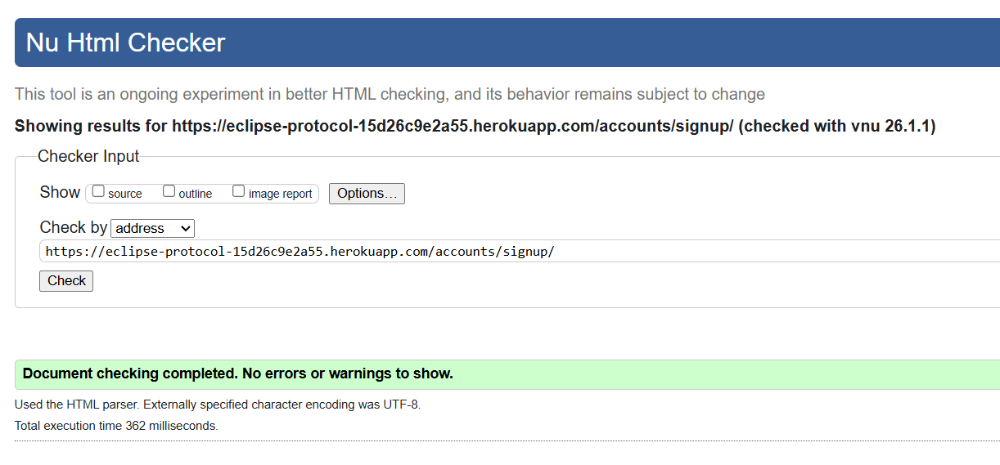 | [Signup Result](https://validator.w3.org/nu/?doc=https%3A%2F%2Feclipse-protocol-15d26c9e2a55.herokuapp.com%2Faccounts%2Fsignup%2F) |  |
| [Order History Page](https://eclipse-protocol-15d26c9e2a55.herokuapp.com/accounts/) | `/accounts/` | ✅ | 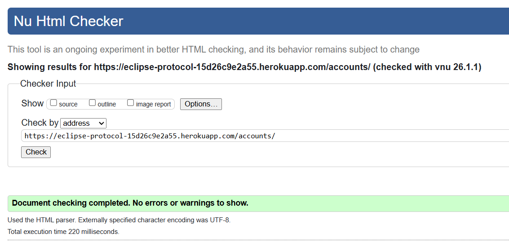 | [Order History Result](https://validator.w3.org/nu/?doc=https%3A%2F%2Feclipse-protocol-15d26c9e2a55.herokuapp.com%2Faccounts%2F) |  |
| [Saved Addresses Page](https://eclipse-protocol-15d26c9e2a55.herokuapp.com/accounts/addresses/) | `/accounts/addresses/` | ✅ | 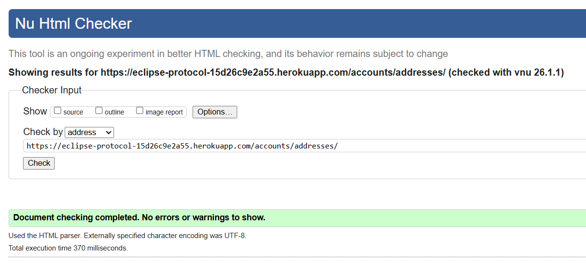 | [Saved Addresses Result](https://validator.w3.org/nu/?doc=https%3A%2F%2Feclipse-protocol-15d26c9e2a55.herokuapp.com%2Faccounts%2Faddresses%2F) |  |
| [Saved Address Form](https://eclipse-protocol-15d26c9e2a55.herokuapp.com/accounts/addresses/add/) | `/accounts/addresses/add/` | ✅ | 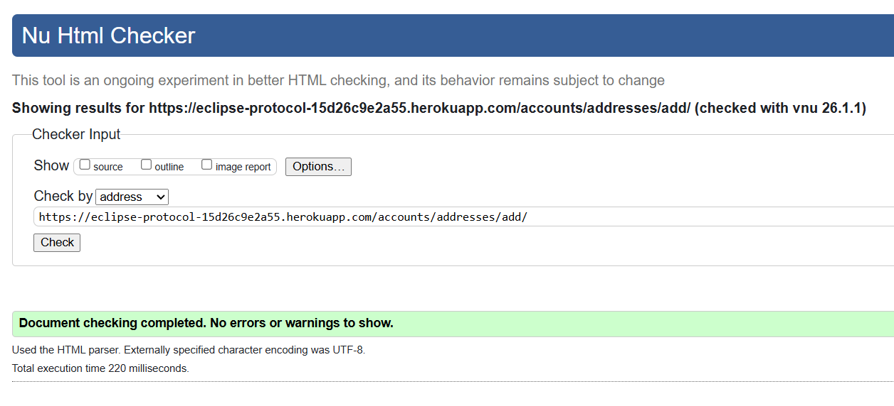 | [Saved Address Form Result](https://validator.w3.org/nu/?doc=https%3A%2F%2Feclipse-protocol-15d26c9e2a55.herokuapp.com%2Faccounts%2Faddresses%2Fadd%2F) |  |
| [Wishlist Page](https://eclipse-protocol-15d26c9e2a55.herokuapp.com/accounts/wishlist/) | `/accounts/wishlist/` | ✅ | 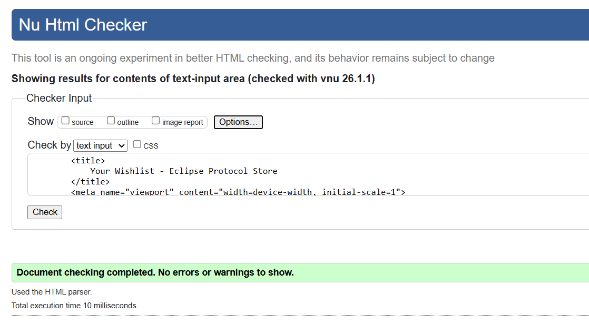 | Login required. Validated by text input |  |
| [Admin Sales Dashboard](https://eclipse-protocol-15d26c9e2a55.herokuapp.com/admin/dashboard/sales/) | `/admin-dashboard/` | ✅ | 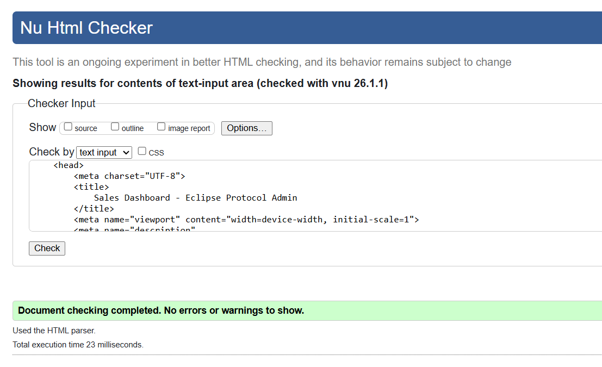 | Staff login required. Validated by text input |  |
| [Search Results Page](https://eclipse-protocol-15d26c9e2a55.herokuapp.com/products/search/?q=test) | `/products/search/` | ✅ | 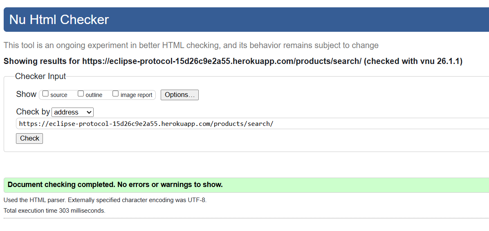 | [Search Results Result](https://validator.w3.org/nu/?doc=https%3A%2F%2Feclipse-protocol-15d26c9e2a55.herokuapp.com%2Fproducts%2Fsearch%2F%3Fq%3Dtest) |  |
| [Currency Detail Page](https://eclipse-protocol-15d26c9e2a55.herokuapp.com/products/currency/) | `/products/currency/` | ✅ | 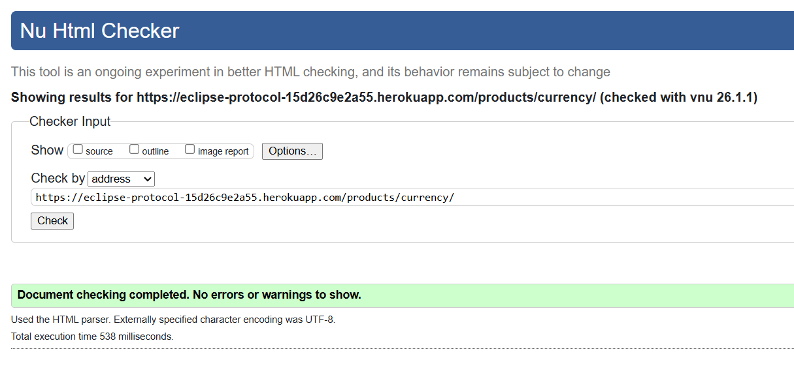 | [Currency Detail Result](https://validator.w3.org/nu/?doc=https%3A%2F%2Feclipse-protocol-15d26c9e2a55.herokuapp.com%2Fproducts%2Fcurrency%2F) |  |
| [Game Edition Detail Page](https://eclipse-protocol-15d26c9e2a55.herokuapp.com/products/base-game/eclipse-protocol/) | `/products/base-game/eclipse-protocol/` | ✅ | 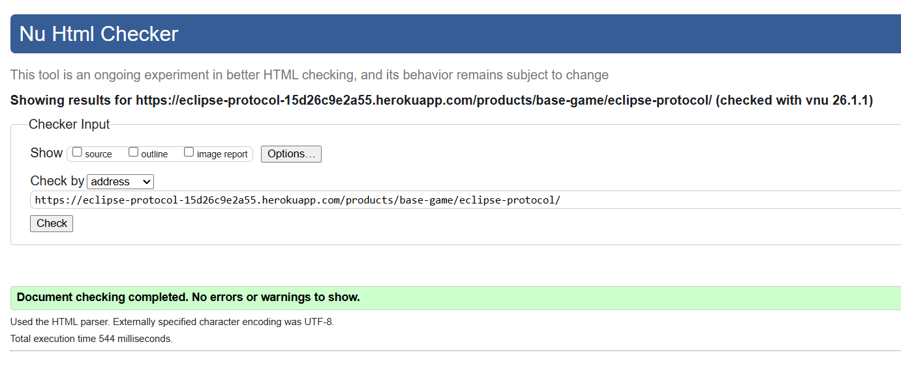 | [Game Edition Detail Result](https://validator.w3.org/nu/?doc=https%3A%2F%2Feclipse-protocol-15d26c9e2a55.herokuapp.com%2Fproducts%2Fbase-game%2Feclipse-protocol%2F) |  |
| [Cart Page](https://eclipse-protocol-15d26c9e2a55.herokuapp.com/cart/) | `/cart/` | ✅ | 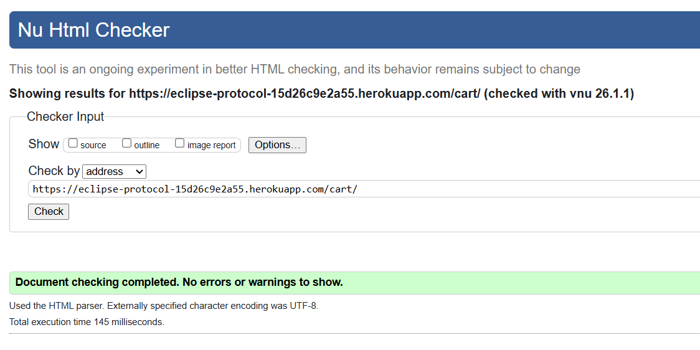 | [Cart Result](https://validator.w3.org/nu/?doc=https%3A%2F%2Feclipse-protocol-15d26c9e2a55.herokuapp.com%2Fcart%2F) |  |
| [Checkout Page](https://eclipse-protocol-15d26c9e2a55.herokuapp.com/checkout/) | `/checkout/` | ✅ | 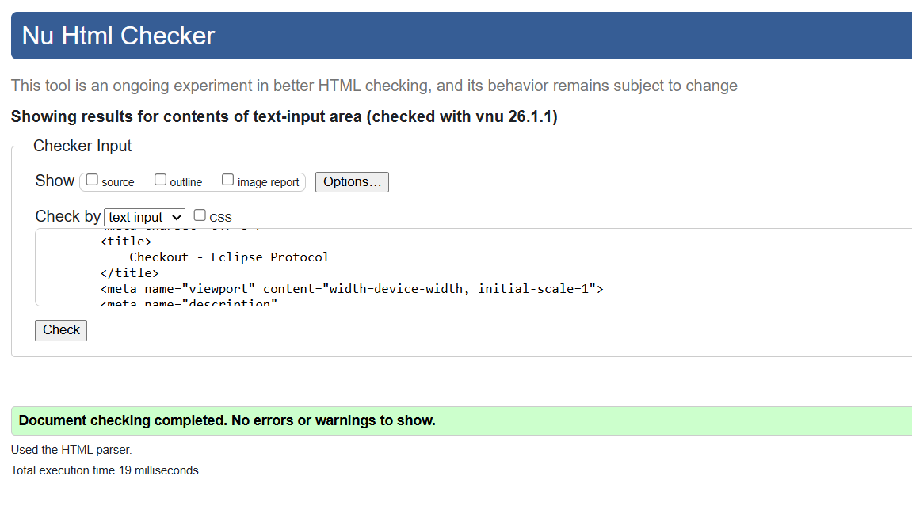 | Login required. Validated by text input |  |
| [Review Order Page](https://eclipse-protocol-15d26c9e2a55.herokuapp.com/checkout/review/) | `/checkout/review/` | ✅ | 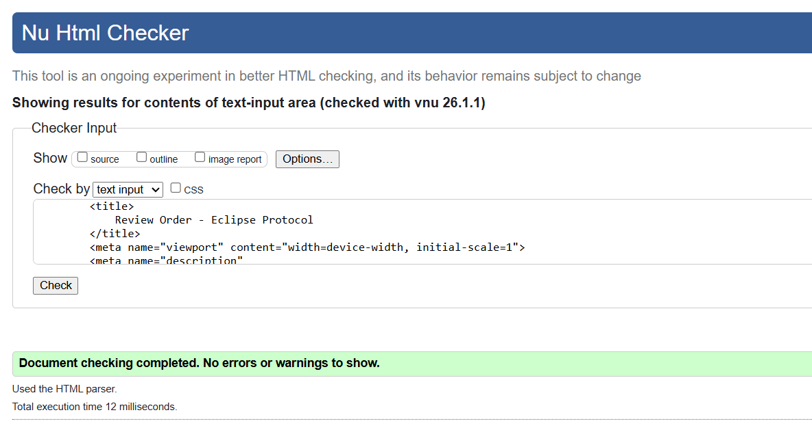 | Login required. Validated by text input |  |
| [Payment Page](https://eclipse-protocol-15d26c9e2a55.herokuapp.com/checkout/payment/) | `/checkout/payment/` | ✅ | 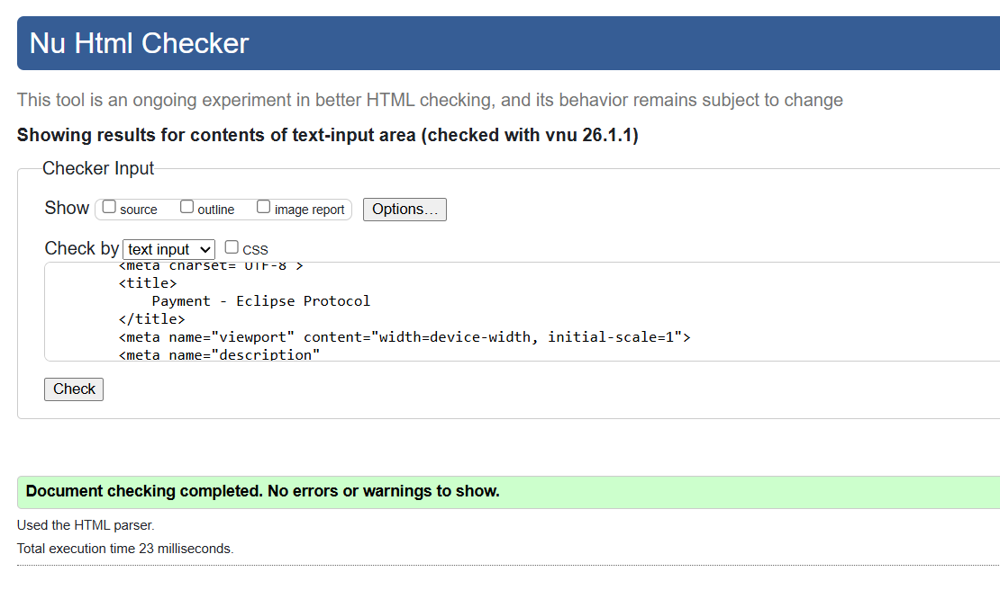 | Login required. Validated by text input |  |
| [Order Confirmation Page](https://eclipse-protocol-15d26c9e2a55.herokuapp.com/checkout/confirmation/) | `/checkout/confirmation/` | ✅ | 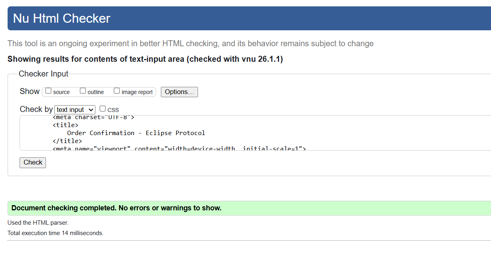 | Login required. Validated by text input |  |
| [404 Error Page](https://eclipse-protocol-15d26c9e2a55.herokuapp.com/nonexistentpage/) | `/nonexistentpage/` | ✅ | 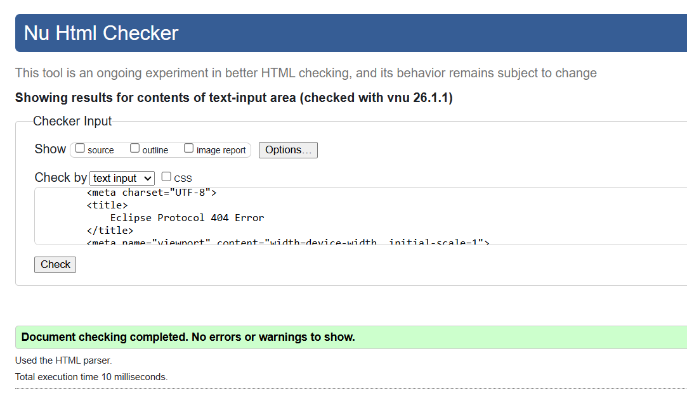 | Validated by text input |  |
| 500 Error Page |  | ✅ | 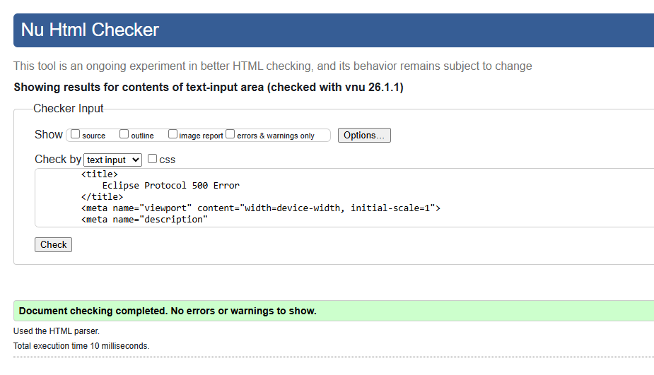 | Validated by text input with temp view/url |  |
| [About Page](https://eclipse-protocol-15d26c9e2a55.herokuapp.com/pages/about/) | `/pages/about/` | ✅ | 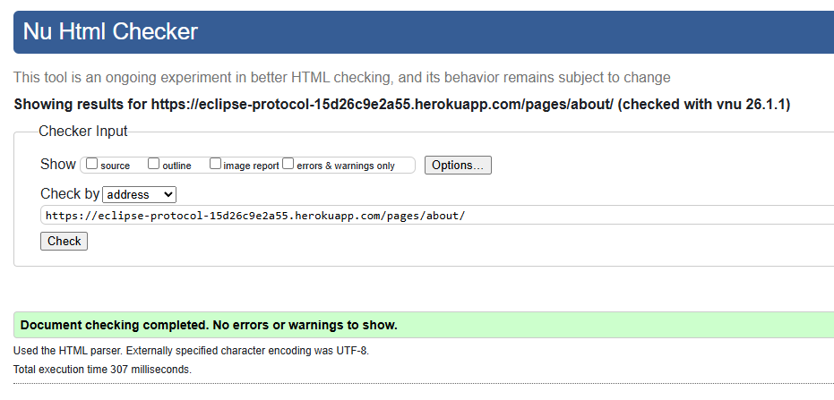 | [About Result](https://validator.w3.org/nu/?doc=https%3A%2F%2Feclipse-protocol-15d26c9e2a55.herokuapp.com%2Fpages%2Fabout%2F) |  |
| [FAQs Page](https://eclipse-protocol-15d26c9e2a55.herokuapp.com/pages/faqs/) | `/pages/faqs/` | ✅ | 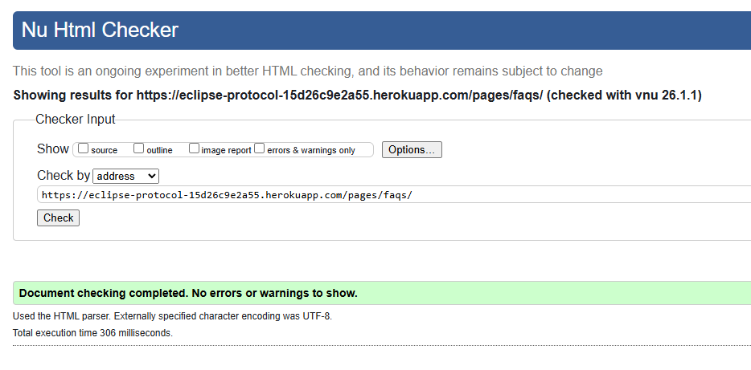 | [FAQs Result](https://validator.w3.org/nu/?doc=https%3A%2F%2Feclipse-protocol-15d26c9e2a55.herokuapp.com%2Fpages%2Ffaqs%2F) |  |
| [Contact Support Page](https://eclipse-protocol-15d26c9e2a55.herokuapp.com/pages/contact/) | `/pages/contact/` | ✅ | 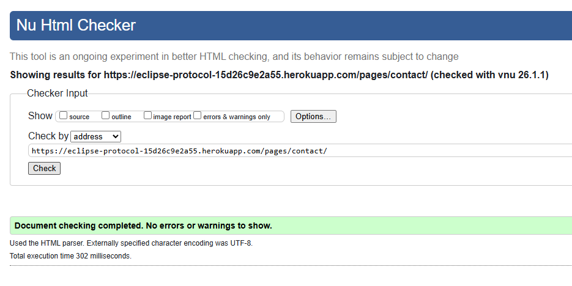 | [Contact Result](https://validator.w3.org/nu/?doc=https%3A%2F%2Feclipse-protocol-15d26c9e2a55.herokuapp.com%2Fpages%2Fcontact%2F) |  |
| [Contact Confirmation Page](https://eclipse-protocol-15d26c9e2a55.herokuapp.com/pages/contact-confirmation/) | `/pages/contact-confirmation/` | ✅ | 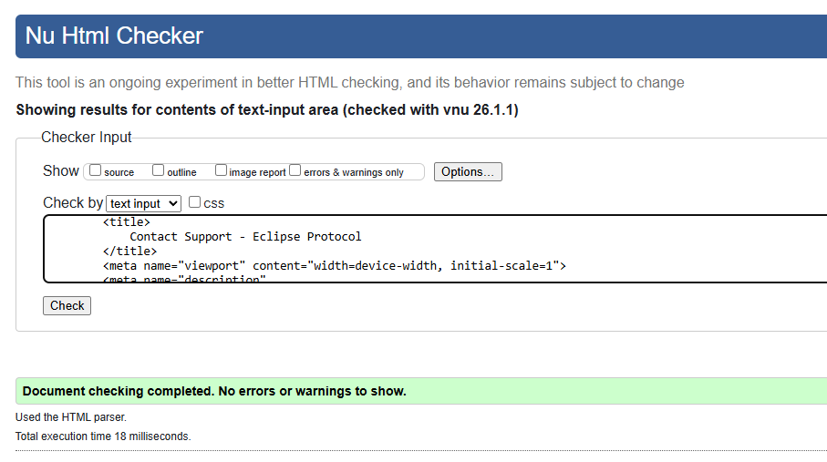 | [Contact Confirmation Result](https://validator.w3.org/nu/?doc=https%3A%2F%2Feclipse-protocol-15d26c9e2a55.herokuapp.com%2Fpages%2Fcontact-confirmation%2F) |  |
| [Privacy Policy Page](https://eclipse-protocol-15d26c9e2a55.herokuapp.com/pages/privacy-policy/) | `/pages/privacy-policy/` | ✅ | 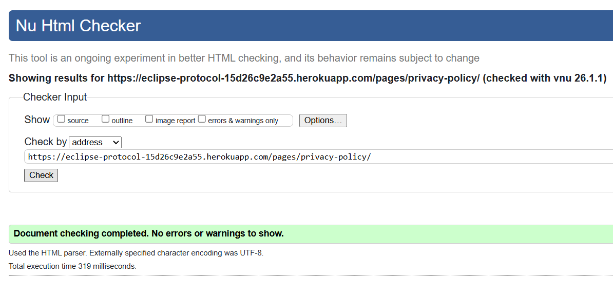 | [Privacy Policy Result](https://validator.w3.org/nu/?doc=https%3A%2F%2Feclipse-protocol-15d26c9e2a55.herokuapp.com%2Fpages%2Fprivacy-policy%2F) |  |
| [Terms and Conditions Page](https://eclipse-protocol-15d26c9e2a55.herokuapp.com/pages/terms-and-conditions/) | `/pages/terms-and-conditions/` | ✅ | 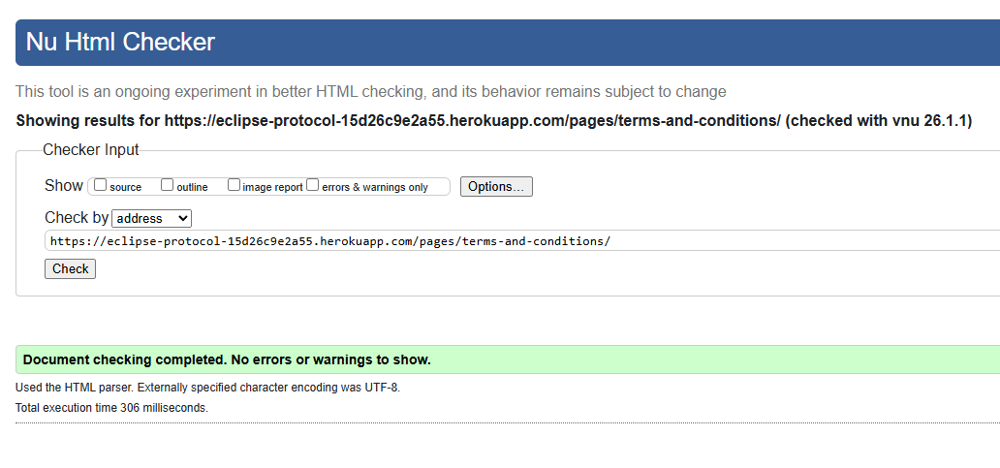 | [Terms and Conditions Result](https://validator.w3.org/nu/?doc=https%3A%2F%2Feclipse-protocol-15d26c9e2a55.herokuapp.com%2Fpages%2Fterms-and-conditions%2F) |  |


**Notes:**
¹ **Login Page Language Warning:** W3C usually reports OK but occasionally flags the page as Norwegian due to automatic language detection. The page correctly uses `lang="en-GB"`, `LANGUAGE_CODE = 'en-gb'`, and `LocaleMiddleware` sends `Content-Language: en`. This intermittent issue matches a known validator [issue](https://github.com/validator/validator/issues/321). It mostly occurs on form pages with minimal text.

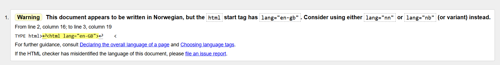

## 2. CSS Validation

## CSS Validation

All CSS files tested using [W3C CSS Validation Service](https://jigsaw.w3.org/css-validator/).

Files tested:
- `accounts.css`
- `admin.css`
- `base.css`
- `billing.css`
- `components.css`
- `layout.css`
- `products.css`
- `variables.css`

All CSS files passed validation. 

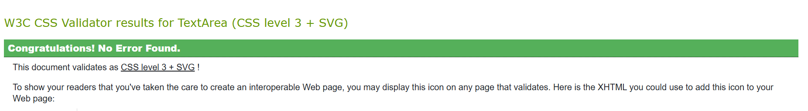

## 3. JavaScript Validation

## JavaScript Validation

All JavaScript files tested using **ESLint** with configuration defined in `eslint.config.js`.

### ESLint Configuration
- Configuration file: [`eslint.config.js`](eslint.config.js)
- Environment: Browser globals with ES2024+ support
- Rules: Code quality, best practices, and consistent styling
- Special handling for Django template variables (`stripePublicKey`, `clientSecret`)
- Allows functions exposed globally for HTML event handlers

### Validation Commands
```bash

# individual file testing
eslint static/js/filename.js

# all JavaScript files testing
eslint static/js/

# individual file formatting/fixing
eslint static/js/filename.js --fix

# all JavaScript files formatting/fixing
eslint static/js/ --fix
```

### Results
No errors found. Minor warnings for intentionally unused variables that serve specific purposes:
- Functions exposed to global scope for HTML onclick handlers (`copyKey`, `addToCart`, `showToast`)
- Parameters prefixed with underscore indicating intentional non-usage (`_keyCode`)
- Functions that may be called by other scripts or event handlers (`updateCartItem`)

| File | Status | ESLint Screenshot | 
|------|--------|-------------------|
| `carousel.js` | ✅ | 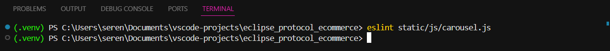 |  
| `cart.js` | ✅ | 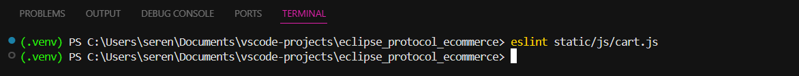 |  
| `currency-selection.js` | ✅ | 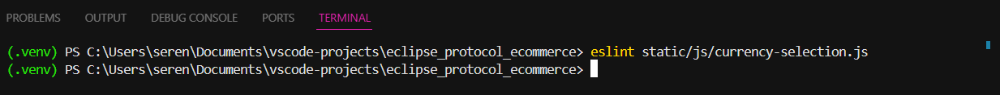 |  
| `edition-selection.js` | ✅ | 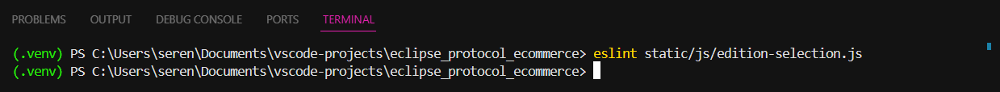 |  
| `stripe-elements.js` | ✅ | 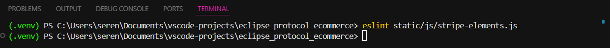 |  
| `utilities.js` | ✅ | 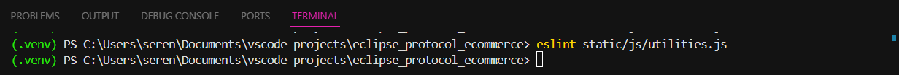 |  
| `wishlist.js` | ✅ | 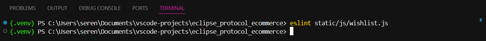 |  


## 4. Python Code Quality

## Python Code Quality

All Python files tested using **Flake8** with configuration defined in `.flake8` file.

### Flake8 Configuration
- Configuration file: [`.flake8`](.flake8)
- Line length: 79 characters
- Excluded directories: migrations, __pycache__, .venv
- Key rules enforced: PEP 8 compliance, unused imports, line length, indentation

### Code Formatting
- **Black**: Automatic code formatting with 79-character line length
- **isort**: Import statement organisation and sorting
- Configuration: [`pyproject.toml`](pyproject.toml)

Commands used:
```bash
# Format all Python files
black .

# Format individual file
black path/to/file.py

# Sort imports
isort .

# Check formatting without changes
black --check .
isort --check-only .

# Run Flake8 for code quality checks
flake8 .
```

| File | Status | Flake8 Screenshot |
|------|--------|-------------------|
| `accounts` | ✅ | 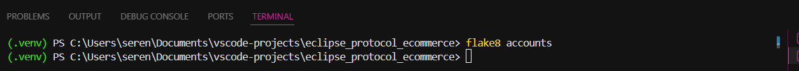 |  
| `cart` | ✅ | 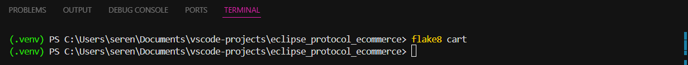 |  
| `catalog` | ✅ | 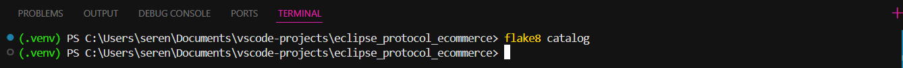 | |  
| `checkout` | ✅ | 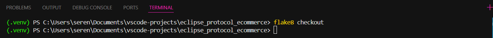 |  
| `core` | ✅ | 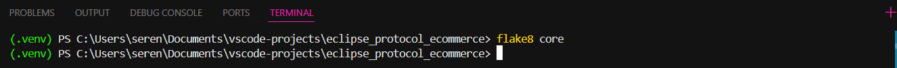 | 
| `eclipse_protocol` | ✅ | 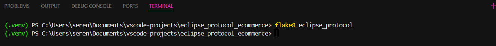 |
| `support` | ✅ | 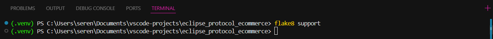 |


## 5. Lighthouse Performance Testing

## Lighthouse Performance Testing

All pages tested using Google Lighthouse for performance, accessibility, best practices, and SEO optimisation. Testing conducted on both desktop and mobile devices to ensure responsive performance. 

| Page | Desktop Results | Mobile Results | Notes |
|------|-----------------|----------------|-------|
| [Home Store Front Page](https://eclipse-protocol-15d26c9e2a55.herokuapp.com/) | 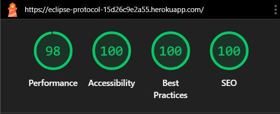 | 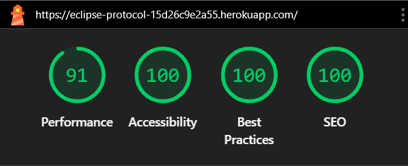 |  |
| [Login Page](https://eclipse-protocol-15d26c9e2a55.herokuapp.com/accounts/login/) | 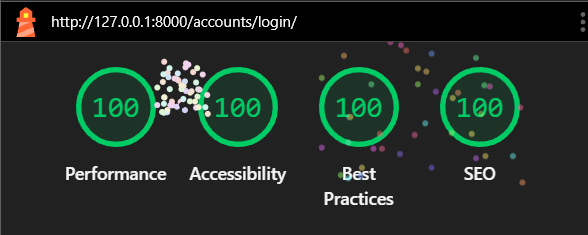 | 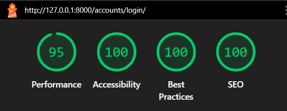 |  |
| [Signup Page](https://eclipse-protocol-15d26c9e2a55.herokuapp.com/accounts/signup/) | 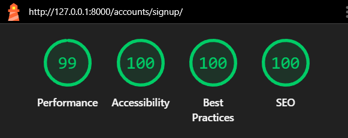 | 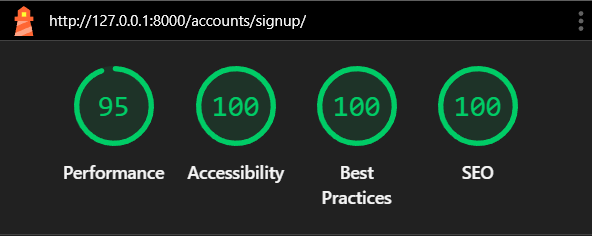 |  |
| [Order History Page](https://eclipse-protocol-15d26c9e2a55.herokuapp.com/accounts/) | 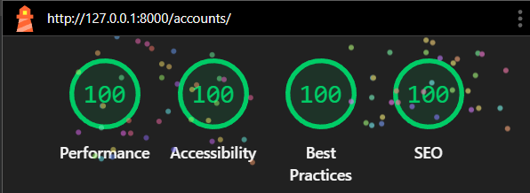 | 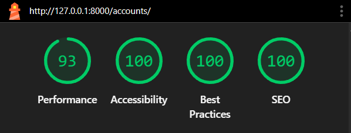 |  |
| [Saved Addresses Page](https://eclipse-protocol-15d26c9e2a55.herokuapp.com/accounts/addresses/) | 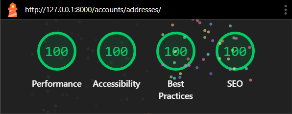 | 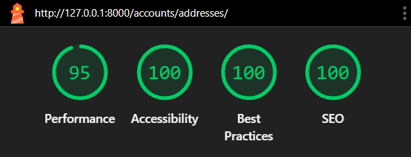 |  |
| [Add/Edit Address Form](https://eclipse-protocol-15d26c9e2a55.herokuapp.com/accounts/addresses/add/) |  |  |  |
| [Wishlist Page](https://eclipse-protocol-15d26c9e2a55.herokuapp.com/accounts/wishlist/) |  |  |  |
| [Search Results Page](https://eclipse-protocol-15d26c9e2a55.herokuapp.com/products/search/?q=test) |  |  |  |
| [Currency Detail Page](https://eclipse-protocol-15d26c9e2a55.herokuapp.com/products/currency/) |  |  |  |
| [Game Edition Detail Page](https://eclipse-protocol-15d26c9e2a55.herokuapp.com/products/base-game/eclipse-protocol/) |  |  |  |
| [Cart Page](https://eclipse-protocol-15d26c9e2a55.herokuapp.com/cart/) |  |  |  |
| [Checkout Page](https://eclipse-protocol-15d26c9e2a55.herokuapp.com/checkout/) |  |  |  |
| [Review Order Page](https://eclipse-protocol-15d26c9e2a55.herokuapp.com/checkout/review/) |  |  |  |
| [Payment Page](https://eclipse-protocol-15d26c9e2a55.herokuapp.com/checkout/payment/) |  |  |  |
| [Order Confirmation Page](https://eclipse-protocol-15d26c9e2a55.herokuapp.com/checkout/confirmation/) |  |  |  |
| [404 Error Page](https://eclipse-protocol-15d26c9e2a55.herokuapp.com/nonexistentpage/) |  |  |  |
| [About Page](https://eclipse-protocol-15d26c9e2a55.herokuapp.com/pages/about/) |  |  |  |
| [FAQs Page](https://eclipse-protocol-15d26c9e2a55.herokuapp.com/pages/faqs/) |  |  |  |
| [Contact Support Page](https://eclipse-protocol-15d26c9e2a55.herokuapp.com/pages/contact/) |  |  |  |
| [Contact Confirmation Page](https://eclipse-protocol-15d26c9e2a55.herokuapp.com/pages/contact-confirmation/) |  |  |  |
| [Privacy Policy Page](https://eclipse-protocol-15d26c9e2a55.herokuapp.com/pages/privacy-policy/) |  |  |  |
| [Terms and Conditions Page](https://eclipse-protocol-15d26c9e2a55.herokuapp.com/pages/terms-and-conditions/) |  |  |  |
| [Admin Sales Dashboard](https://eclipse-protocol-15d26c9e2a55.herokuapp.com/admin-dashboard/) |  |  | Staff login required. |


## 6. Responsiveness Design Testing
## Responsiveness Design Testing

All pages tested across various screen sizes and devices to ensure responsive design and optimal user experience. Testing conducted using browser developer tools and physical devices.

**Browsers Tested:**
- Google Chrome
- Mozilla Firefox
- Microsoft Edge
- Safari
- Opera

**Devices Tested:**
- Desktop (various resolutions)
- Tablets
- Mobile Phones iOS and Android
- BrowserStack for cross-browser/device testing

## Home Store Front Page Responsiveness Screenshots

| Desktop | Tablet | Tablet Landscape | Mobile | Mobile Landscape |
|---------|--------|------------------|--------|------------------|
|  |  |  |  |  |

## Signup Page Responsiveness Screenshots

| Desktop | Tablet | Tablet Landscape | Mobile | Mobile Landscape |
|---------|--------|------------------|--------|------------------|
|  |  |  |  |  |

## Login Page Responsiveness Screenshots

| Desktop | Tablet | Tablet Landscape | Mobile | Mobile Landscape |
|---------|--------|------------------|--------|------------------|
|  |  |  |  |  |

## Order History Page Responsiveness Screenshots
| Desktop | Tablet | Tablet Landscape | Mobile | Mobile Landscape |
|---------|--------|------------------|--------|------------------|
|  |  |  |  |  |

## Saved Addresses Page Responsiveness Screenshots
| Desktop | Tablet | Tablet Landscape | Mobile | Mobile Landscape |
|---------|--------|------------------|--------|------------------|
|  |  |  |  |  |

## Add/Edit Address Form Responsiveness Screenshots
| Desktop | Tablet | Tablet Landscape | Mobile | Mobile Landscape |
|---------|--------|------------------|--------|------------------|
|  |  |  |  |  |

## Wishlist Page Responsiveness Screenshots
| Desktop | Tablet | Tablet Landscape | Mobile | Mobile Landscape |
|---------|--------|------------------|--------|------------------|
|  |  |  |  |  |

## Search Results Page Responsiveness Screenshots
| Desktop | Tablet | Tablet Landscape | Mobile | Mobile Landscape |
|---------|--------|------------------|--------|------------------|
|  |  |  |  |  |

## Currency Detail Page Responsiveness Screenshots
| Desktop | Tablet | Tablet Landscape | Mobile | Mobile Landscape |
|---------|--------|------------------|--------|------------------|
|  |  |  |  |  |

## Game Edition Detail Page Responsiveness Screenshots
| Desktop | Tablet | Tablet Landscape | Mobile | Mobile Landscape |
|---------|--------|------------------|--------|------------------|
|  |  |  |  |  |

## Cart Page Responsiveness Screenshots
| Desktop | Tablet | Tablet Landscape | Mobile | Mobile Landscape |
|---------|--------|------------------|--------|------------------|
|  |  |  |  |  |

## Checkout Page Responsiveness Screenshots
| Desktop | Tablet | Tablet Landscape | Mobile | Mobile Landscape |
|---------|--------|------------------|--------|------------------|
|  |  |  |  |  |

## Review Order Page Responsiveness Screenshots
| Desktop | Tablet | Tablet Landscape | Mobile | Mobile Landscape |
|---------|--------|------------------|--------|------------------|
|  |  |  |  |  |

## Payment Page Responsiveness Screenshots
| Desktop | Tablet | Tablet Landscape | Mobile | Mobile Landscape |
|---------|--------|------------------|--------|------------------|
|  |  |  |  |  |

## Order Confirmation Page Responsiveness Screenshots
| Desktop | Tablet | Tablet Landscape | Mobile | Mobile Landscape |
|---------|--------|------------------|--------|------------------|
|  |  |  |  |  |

## About Page Responsiveness Screenshots
| Desktop | Tablet | Tablet Landscape | Mobile | Mobile Landscape |
|---------|--------|------------------|--------|------------------|
|  |  |  |  |  |

## FAQs Page Responsiveness Screenshots
| Desktop | Tablet | Tablet Landscape | Mobile | Mobile Landscape |
|---------|--------|------------------|--------|------------------|
|  |  |  |  |  |

## Contact Support Page Responsiveness Screenshots
| Desktop | Tablet | Tablet Landscape | Mobile | Mobile Landscape |
|---------|--------|------------------|--------|------------------|
|  |  |  |  |  |

## Contact Confirmation Page Responsiveness Screenshots
| Desktop | Tablet | Tablet Landscape | Mobile | Mobile Landscape |
|---------|--------|------------------|--------|------------------|
|  |  |  |  |  |

## Privacy Policy Page Responsiveness Screenshots
| Desktop | Tablet | Tablet Landscape | Mobile | Mobile Landscape |
|---------|--------|------------------|--------|------------------|
|  |  |  |  |  |

## Terms and Conditions Page Responsiveness Screenshots
| Desktop | Tablet | Tablet Landscape | Mobile | Mobile Landscape | 
|---------|--------|------------------|--------|------------------|
|  |  |  |  |  |

## 404 Error Page Responsiveness Screenshots
| Desktop | Tablet | Tablet Landscape | Mobile | Mobile Landscape |
|---------|--------|------------------|--------|------------------|
|  |  |  |  |  |

## 7. User Story Testing

User story testing conducted to ensure all features meet specified requirements and function as intended. Each user story tested individually with documented results according to acceptance criteria from [GitHub Project Board](https://github.com/users/Seren-Hughes/projects/9).

### Theme 1: Digital Storefront

#### Epic 1.1: Browse & Discover Digital Products

| Story No. | User Story | Test Steps | Expected Result | Actual Result | Status | Notes |
|-----------|------------|------------|-----------------|---------------|--------|-------|
| 1.1.1 | As a customer, I want to browse all available digital products (base game, DLC, credits etc.) so I can see what's available for my platform. | 1. Navigate to home page<br>2. View product listings<br>3. Check all product types are displayed | All digital products visible with clear categorisation | ✅ Products displayed correctly by type | ✅ PASS | Site shows currency packs and game editions |
| 1.1.2 | As a customer, I want to filter digital items by platform (Steam, Xbox, Nintendo, PlayStation) so I only see compatible content. | 1. Access product filtering<br>2. Select platform filter<br>3. Verify results match platform | Only platform-compatible products shown | ⏸️ Not implemented in MVP | ⏸️ Deferred | _Should have_ priority for phase 2 development |
| 1.1.3 | As a customer, I want to sort or filter by relevance or price so I can easily find what I want. | 1. Access sorting options<br>2. Sort by price<br>3. Verify correct order | Products sorted according to selected criteria | ⏸️ Not implemented in MVP | ⏸️ Deferred | _Should have_ priority for phase 2 development |

#### Epic 1.2: Product Details

| Story No. | User Story | Test Steps | Expected Result | Actual Result | Status | Notes |
|-----------|------------|------------|-----------------|---------------|--------|-------|
| 1.2.1 | As a customer, I want to view detailed product pages with descriptions, editions, prices, and platform options so I can make informed decisions. | 1. Click on product<br>2. Review product detail page<br>3. Check all information present | Complete product information displayed | ✅ All details shown clearly | ✅ PASS | Detailed product pages include descriptions, pricing, and platform options |
| 1.2.2 | As a customer, I want to see information on delivery method (redeemable key or automatic activation) before purchase. | 1. View product details<br>2. Check delivery method information<br>3. Verify clarity before purchase | Delivery method clearly indicated | ✅ Delivery method specified | ✅ PASS | License key delivery method clearly stated |

#### Epic 1.3: Product Management (Admin)

| Story No. | User Story | Test Steps | Expected Result | Actual Result | Status | Notes |
|-----------|------------|------------|-----------------|---------------|--------|-------|
| 1.3.1 | As a site admin, I want to create, edit, and delete product listings so I can manage the catalogue easily. | 1. Log in as admin<br>2. Access Django admin<br>3. Create/edit/delete products<br>4. Verify changes reflect on site | Product CRUD operations work correctly | ✅ Admin management functional | ✅ PASS | Full CRUD functionality available in Django admin |

### Theme 2: Digital Checkout & Delivery

#### Epic 2.1: Purchase & Payment

| Story No. | User Story | Test Steps | Expected Result | Actual Result | Status | Notes |
|-----------|------------|------------|-----------------|---------------|--------|-------|
| 2.1.1 | As a customer, I want to add digital items to my basket and securely purchase them so I can access them in my account. | 1. Add items to cart<br>2. Proceed to checkout<br>3. Complete payment<br>4. Check account for items | Items successfully added to cart and purchased | ✅ Cart and checkout functionality works | ✅ PASS | Full shopping cart and secure checkout implemented |
| 2.1.2 | As a customer, I want to view an order summary and confirm before paying. | 1. Add items to cart<br>2. Proceed to checkout<br>3. Review order summary<br>4. Confirm before payment | Clear order summary with confirmation step | ✅ Order review step present | ✅ PASS | Order review page implemented before payment |

#### Epic 2.2: Delivery & Key Management

| Story No. | User Story | Test Steps | Expected Result | Actual Result | Status | Notes |
|-----------|------------|------------|-----------------|---------------|--------|-------|
| 2.2.1 | As a customer, I want my digital key or credits to be automatically applied to my account and emailed after purchase. | 1. Complete purchase<br>2. Check email for confirmation<br>3. Check account dashboard<br>4. Verify keys/credits delivered | Digital items delivered automatically with email confirmation | ✅ Automatic delivery works | ✅ PASS | License keys generated and emailed automatically |

#### Epic 2.3: Order History

| Story No. | User Story | Test Steps | Expected Result | Actual Result | Status | Notes |
|-----------|------------|------------|-----------------|---------------|--------|-------|
| 2.3.1 | As a customer, I want to view my order history with product names, dates, and total amounts so I can track past purchases. | 1. Log into account<br>2. Navigate to order history<br>3. Review past orders<br>4. Verify details are complete | Complete order history with all relevant details | ✅ Order history page functional | ✅ PASS | Comprehensive order history in account dashboard |

#### Epic 2.4: License Management (Admin)

| Story No. | User Story | Test Steps | Expected Result | Actual Result | Status | Notes |
|-----------|------------|------------|-----------------|---------------|--------|-------|
| 2.4.1 | As a site admin, I want to manage license key generation and mark keys as redeemed so availability stays accurate. | 1. Log in as admin<br>2. Access license key management<br>3. View key generation<br>4. Check redemption tracking | License keys managed effectively by admin | ✅ Admin license management works | ✅ PASS | License key management available in Django admin |

### Theme 3: Merchandise Store

#### Epic 3.1: Browse & Purchase Merchandise

| Story No. | User Story | Test Steps | Expected Result | Actual Result | Status | Notes |
|-----------|------------|------------|-----------------|---------------|--------|-------|
| 3.1.1 | As a customer, I want to browse official merchandise (t-shirts, hoodies, mugs) so I can support the brand I enjoy. | 1. Navigate to merchandise section<br>2. Browse available items<br>3. View product details | Merchandise products clearly displayed | ⏸️ Not implemented in MVP | ⏸️ DEFERRED | _Could Have_ priority - planned for Phase 3 |

#### Epic 3.2: Checkout & Delivery

| Story No. | User Story | Test Steps | Expected Result | Actual Result | Status | Notes |
|-----------|------------|------------|-----------------|---------------|--------|-------|
| 3.2.1 | As a customer, I want to add items to my basket, enter my shipping details, and select delivery options so I can receive my order. | 1. Add merchandise to cart<br>2. Enter shipping details<br>3. Select delivery options<br>4. Complete order | Physical goods checkout process works | ⏸️ Not implemented in MVP | ⏸️ DEFERRED | _Could Have_ priority - planned for Phase 3 |
| 3.2.2 | As a customer, I want to choose between standard and express shipping to control delivery time and cost. | 1. Add physical items to cart<br>2. View shipping options<br>3. Select preferred shipping<br>4. Verify cost calculation | Multiple shipping options available with pricing | ⏸️ Not implemented in MVP | ⏸️ DEFERRED | _Could Have_ priority - planned for Phase 3 |

#### Epic 3.3: Admin Fulfilment

| Story No. | User Story | Test Steps | Expected Result | Actual Result | Status | Notes |
|-----------|------------|------------|-----------------|---------------|--------|-------|
| 3.3.1 | As a site admin, I want to update stock levels and mark orders as shipped so customers stay informed. | 1. Log in as admin<br>2. Access order management<br>3. Update order status<br>4. Verify customer notification | Stock and shipping management functional | ⏸️ Not implemented in MVP | ⏸️ DEFERRED | _Could Have_ priority - planned for Phase 3 |
| 3.3.2 | As a customer, I want to choose between standard and express shipping to control delivery time and cost. | 1. Add physical items to cart<br>2. View shipping options<br>3. Select preferred shipping<br>4. Verify cost calculation | Multiple shipping options available with pricing | ⏸️ Not implemented in MVP | ⏸️ DEFERRED | _Could Have_ priority - planned for Phase 3 |

### Theme 4: Accounts & Authentication

#### Epic 4.1: Player Accounts

| Story No. | User Story | Test Steps | Expected Result | Actual Result | Status | Notes |
|-----------|------------|------------|-----------------|---------------|--------|-------|
| 4.1.1 | As a customer, I want to register and log in with my email so I can access purchases and manage my account. | 1. Register new account<br>2. Verify email login<br>3. Access account dashboard<br>4. Manage account settings | User registration and login functional | ✅ Authentication system works | ✅ PASS | Full user authentication with Django Allauth |
| 4.1.2 | As a customer, I want to save my billing and shipping addresses for faster future checkouts. | 1. Add address to account<br>2. Save address<br>3. Use saved address in checkout<br>4. Verify faster checkout | Saved addresses work for faster checkout | ✅ Address management functional | ✅ PASS | Saved address functionality implemented |

#### Epic 4.2: Admin User Management

| Story No. | User Story | Test Steps | Expected Result | Actual Result | Status | Notes |
|-----------|------------|------------|-----------------|---------------|--------|-------|
| 4.2.1 | As a site admin, I want to view registered users and manage roles so I can maintain store security. | 1. Log in as admin<br>2. Access user management<br>3. View user list<br>4. Manage user roles | Admin user management functional | ✅ User management works | ✅ PASS | Full user management in Django admin |

### Theme 5: Checkout & Payment

#### Epic 5.1: Secure Payments

| Story No. | User Story | Test Steps | Expected Result | Actual Result | Status | Notes |
|-----------|------------|------------|-----------------|---------------|--------|-------|
| 5.1.1 | As a customer, I want to securely pay for items using Stripe so my payment details are protected. | 1. Add items to cart<br>2. Proceed to payment<br>3. Enter payment details<br>4. Complete secure payment | Stripe payment processing works securely | ✅ Stripe integration functional | ✅ PASS | Secure Stripe payment processing implemented |
| 5.1.2 | As a customer, I want to review my order summary and total cost before finalising payment so I can confirm my purchase. | 1. Add items to cart<br>2. Proceed to checkout<br>3. Review order summary<br>4. Confirm totals before payment | Order review with accurate totals | ✅ Order review works correctly | ✅ PASS | Comprehensive order review before payment |

#### Epic 5.2: Admin Order Oversight

| Story No. | User Story | Test Steps | Expected Result | Actual Result | Status | Notes |
|-----------|------------|------------|-----------------|---------------|--------|-------|
| 5.2.1 | As a site admin, I want to see all orders and their payment statuses so I can troubleshoot and manage sales. | 1. Log in as admin<br>2. Access order management<br>3. View all orders<br>4. Check payment statuses | Complete order oversight for admin | ✅ Admin order management works | ✅ PASS | Full order management in Django admin |
| 5.2.2 | As a site admin, I want to process refunds for orders directly from the admin panel so I can resolve customer issues efficiently. | 1. Log in as admin<br>2. Access order<br>3. Process refund<br>4. Verify refund completion | Refund processing from admin panel | ⏸️ Basic functionality implemented | ⏸️ DEFERRED | _Should Have priority_ - basic tracking available. Foundation ready to implement full refund processing in Phase 2.  |

### Theme 6: Subscriptions

#### Epic 6.1: Player Subscription Management

| Story No. | User Story | Test Steps | Expected Result | Actual Result | Status | Notes |
|-----------|------------|------------|-----------------|---------------|--------|-------|
| 6.1.1 | As a customer, I want to subscribe to Eclipse+ for monthly credits, DLC access, and perks so I can get ongoing benefits. | 1. Navigate to subscription page<br>2. Select subscription plan<br>3. Complete subscription signup<br>4. Verify benefits access | Subscription system functional with benefits | ⏸️ Not implemented in MVP | ⏸️ DEFERRED | _Should Have_ priority - planned for Phase 2 |
| 6.1.2 | As a customer, I want to manage or cancel my subscription from my account dashboard so I remain in control. | 1. Log into account<br>2. Access subscription management<br>3. Modify or cancel subscription<br>4. Verify changes applied | Subscription self-management available | ⏸️ Not implemented in MVP | ⏸️ DEFERRED | _Should Have_ priority - planned for Phase 2 |

#### Epic 6.2: Admin Subscription Oversight

| Story No. | User Story | Test Steps | Expected Result | Actual Result | Status | Notes |
|-----------|------------|------------|-----------------|---------------|--------|-------|
| 6.2.1 | As a site admin, I want to view current subscribers and renewal statuses so I can manage billing effectively. | 1. Log in as admin<br>2. Access subscription management<br>3. View subscriber list<br>4. Check renewal statuses | Admin subscription oversight functional | ⏸️ Not implemented in MVP | ⏸️ DEFERRED | _Should Have_ priority - planned for Phase 2 |

### Theme 7: Admin Analytics

#### Epic 7.1: Sales & Performance Insights

| Story No. | User Story | Test Steps | Expected Result | Actual Result | Status | Notes |
|-----------|------------|------------|-----------------|---------------|--------|-------|
| 7.1.1 | As the business owner, I want to see total revenue and best-selling products so I can track performance. | 1. Log in as admin<br>2. Access analytics dashboard<br>3. View revenue metrics<br>4. Check best-selling products | Analytics dashboard with sales insights | ⏸️ Not implemented | ⏸️ DEFERRED | _Won't Have_ priority - future consideration |
| 7.1.2 | As the business owner, I want to view sales data by platform (Steam, Xbox, PlayStation) so I can adjust marketing strategies. | 1. Access analytics<br>2. Filter by platform<br>3. View platform-specific data<br>4. Analyse marketing insights | Platform-specific analytics available | ⏸️ Not implemented | ⏸️ DEFERRED | _Won't Have_ priority - future consideration |

### Theme 8: Reviews & Community

#### Epic 8.1: Product Reviews

| Story No. | User Story | Test Steps | Expected Result | Actual Result | Status | Notes |
|-----------|------------|------------|-----------------|---------------|--------|-------|
| 8.1.1 | As a customer, I want to leave a rating and review on products I've purchased so I can share my opinion. | 1. Purchase product<br>2. Navigate to product page<br>3. Leave review and rating<br>4. Verify review appears | Review system functional for purchased products | ⏸️ Not implemented in MVP | ⏸️ DEFERRED | _Could Have_ priority - planned for Phase 3 |
| 8.1.2 | As a customer, I want to read reviews from other players before purchasing. | 1. Navigate to product page<br>2. View existing reviews<br>3. Read ratings and comments<br>4. Make informed decision | Product reviews visible to all customers | ⏸️ Not implemented in MVP | ⏸️ DEFERRED | _Could Have_ priority - planned for Phase 3 |

#### Epic 8.2: Admin Review Moderation

| Story No. | User Story | Test Steps | Expected Result | Actual Result | Status | Notes |
|-----------|------------|------------|-----------------|---------------|--------|-------|
| 8.2.1 | As a site admin, I want to moderate or remove inappropriate reviews. | 1. Log in as admin<br>2. Access review management<br>3. Moderate reviews<br>4. Remove inappropriate content | Review moderation tools available | ⏸️ Not implemented in MVP | ⏸️ DEFERRED | _Could Have_ priority - planned for Phase 3 |

### Theme 9: Newsletter & Marketing

#### Epic 9.1: Newsletter Subscriptions

| Story No. | User Story | Test Steps | Expected Result | Actual Result | Status | Notes |
|-----------|------------|------------|-----------------|---------------|--------|-------|
| 9.1.1 | As a customer, I want to subscribe to a newsletter for exclusive offers and updates. | 1. Find newsletter signup<br>2. Enter email address<br>3. Confirm subscription<br>4. Verify signup confirmation | Newsletter subscription system functional | ⏸️ Not implemented in MVP | ⏸️ DEFERRED | _Should Have_ priority for Phase 2 |

#### Epic 9.2: Admin Newsletter Management

| Story No. | User Story | Test Steps | Expected Result | Actual Result | Status | Notes |
|-----------|------------|------------|-----------------|---------------|--------|-------|
| 9.2.1 | As a site admin, I want to manage active subscribers so I can send targeted promotions. | 1. Log in as admin<br>2. Access subscriber management<br>3. View subscriber list<br>4. Manage subscriber data | Newsletter management tools available | ⏸️ Not implemented in MVP | ⏸️ DEFERRED | _Should Have_ priority for Phase 2 |

### Summary of Testing Results

Following the comprehensive user story testing, the majority of core functionalities have been successfully implemented and verified. Key features such as product browsing, secure checkout, digital delivery, and user account management have passed all acceptance criteria. Following MoSCoW prioritisation, several 'Should Have' and 'Could Have' features have been deferred to future development phases to ensure timely delivery of the MVP. Overall, the testing phase has confirmed that the digital storefront meets the essential requirements for a functional and user-friendly experience.


